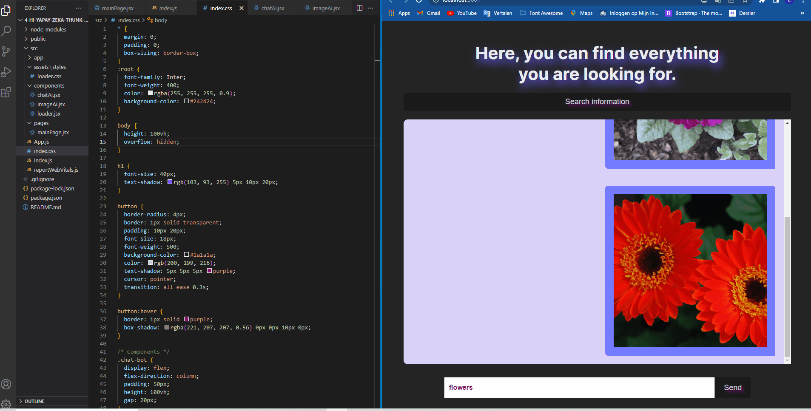

# Proje İsmi: HayalEt
<h3>Chat AI</h3>

This project is a web application that offers both written and visual content to users using artificial intelligence technologies. The project is built using React, Redux, Redux-Thunk ChatGPT and DALL-E2 technologies.

ChatGPT is an artificial intelligence model developed by OpenAI, a leader in natural language processing. By generating human-like text, this model can assist users in creating content automatically.

DALL-E2 is a rendering model developed by OpenAI. This model allows users to create photos using text-based descriptions.

Ghost helps users to produce written content or photos on a specific topic by using ChatGPT and DALL-E2 technologies. When users enter the web application, they can first choose what type of content they want. Then, together with ChatGPT and DallE-2, users are presented with specially created content.

 

The project is developed using React, Redux, Redux-Thunk and therefore users can use the web app on any device.

<h3>Chat AI</h3>

Bu proje, yapay zeka teknolojileri kullanarak kullanıcılara hem yazılı hem de görsel içerikler sunan bir web uygulamasıdır. Proje, React, Redux, Redux-Thunk ChatGPT ve DALL-E2 teknolojilerini kullanarak oluşturulmuştur.

ChatGPT, doğal dil işleme alanında lider olan OpenAI tarafından geliştirilen bir yapay zeka modelidir. Bu model, insan benzeri metinler oluşturarak, kullanıcılara otomatik olarak içerik oluşturma konusunda yardımcı olabilir.

DALL-E2 ise, OpenAI tarafından geliştirilen bir görüntü oluşturma modelidir. Bu model, kullanıcıların metin tabanlı açıklamaları kullanarak fotoğraflar oluşturmasına olanak tanır.

HayalEt, ChatGPT ve DALL-E2 teknolojilerini kullanarak, kullanıcılara belirli bir konuda yazılı içerikler veya fotoğraflar üretme konusunda yardımcı olur. Kullanıcılar, web uygulamasına girdiklerinde, öncelikle hangi tür içerik istediklerini seçebilirler. Daha sonra, ChatGPT ve DallE-2 ile birlikte, kullanıcılara özel olarak oluşturulmuş içerikler sunulur.

 

Proje, React, Redux, Redux-Thunk kullanılarak geliştirilmiştir ve bu nedenle kullanıcılar, herhangi bir cihazda web uygulamasını kullanabilirler.

<h3>Project preview:</h3>

